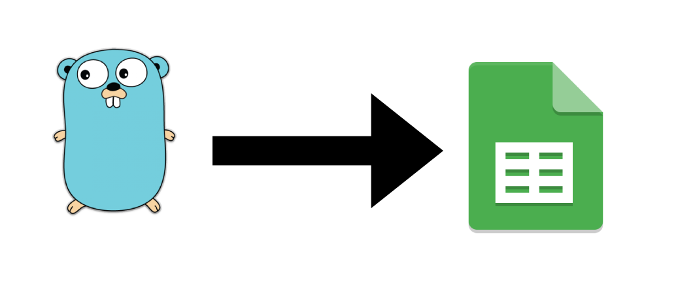

### Go Read Data from Google Spreadsheet Api
```
 create a simple Go command-line application that makes
 requests to the Google Sheets API.
```

### Install package
```
$ go get -u google.golang.org/api/sheets/v4
$ go get -u golang.org/x/oauth2/google
```

### Clone Project
```
$ git clone https://github.com/sutin1234/go-spreadsheet-api.git
```

